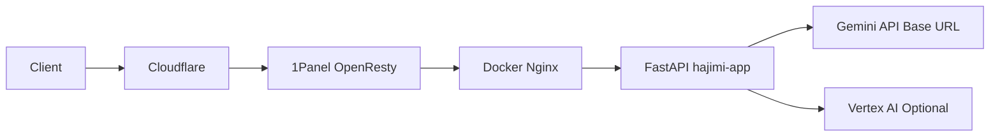

# 架构说明

## 总体拓扑



## 组件职责

- `1Panel OpenResty`
  - 负责域名入口、TLS、外层反向代理
  - 配置文件：`1Panel-gemini.conf`
- `Docker Nginx`
  - 容器内反代，统一超时/CORS/WebSocket
  - 配置文件：`nginx/nginx.conf`, `nginx/conf.d/gemini.conf`
- `FastAPI App`
  - 统一 API 入口、鉴权、限流、缓存、统计、模型转发
  - 入口：`app/main.py`
- `Vue Dashboard`
  - 运维界面，展示统计并更新配置
  - 源码：`page/src`
  - 构建产物：`app/templates`

## 请求链路

### API 调用链路

```text
/v1/chat/completions
 -> FastAPI router
 -> 鉴权 (PASSWORD)
 -> 限流
 -> 缓存命中检查
 -> API Key 轮询/选择
 -> Gemini/Vertex 上游请求
 -> OpenAI 或 Gemini 格式响应
```

### 仪表盘链路

```text
/api/dashboard-data
 -> FastAPI dashboard router
 -> 汇总统计/日志/配置
 -> 前端每秒轮询刷新
```

## 存储架构

- 无关系型数据库依赖
- 后端持久化：
  - `settings/settings.json`
  - `settings/credentials/*.json`
- 前端持久化：
  - `localStorage`（多后端配置）
